# The console

The Noust console is the browser interface to a server running Noust. It is a single-page
application built into the package and served by `noust web start`: no Node, no build step
and no CDN at install time, and nothing is loaded from any other origin at run time. It is a
client of the same [API](api.md) scripts use, so everything on screen is something the API
can do.

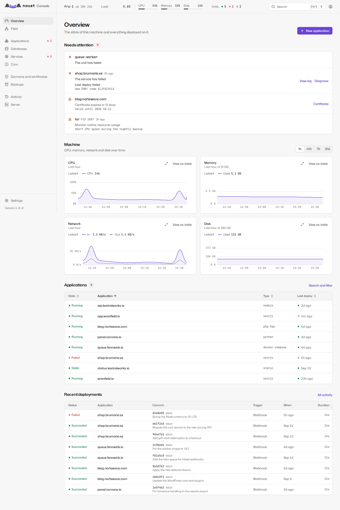

## Starting it

```bash
noust web start           # foreground, 127.0.0.1:8080; prints the access token; Ctrl+C stops it
noust web start -d        # background until 'noust web stop' or the next reboot; prints the token
noust web enable          # a systemd service: survives reboots; prints the token
noust web token --new     # issue a token to sign in with
noust web status          # running or not, and whether as the service or in the background
noust web stop
```

Every start issues a new access token and prints it once, in the same banner whichever way
the console runs: in the foreground, in the background with `-d` (the parent process prints
it before handing the server over to the child), or as a service with `noust web enable`. It
is never silently issued unseen, and systemd starting the service again (at boot, after a
failure, after an upgrade) issues none: it keeps serving the token `noust web enable`
printed. `noust web token` without options only reports whether a token is issued: the token
itself is stored as a salted hash and cannot be shown again. A running console reads the
token from disk on every request, so issuing a new one with `noust web token --new` retires
the old one at once, with no restart needed; see [security.md](security.md#authentication)
for more, including what `--regenerate` invalidates beyond the token itself.

A foreground console runs until you press Ctrl+C or close the SSH session it was started
from; its banner says so, and prints the `noust web enable` line that would keep it running
with the same options. `noust web start -d` runs it as a background process, with its log in
`/var/log/noust/web.log` and its PID in `/run/noust-web.pid`: it does not start again
after a reboot. `noust web restart` takes the same options as `start` and does not remember
the ones used before: pass them again.

### Keep it running

`noust web enable` runs the console as a systemd service, `noust-web.service`: started now,
started again at every boot, and restarted if it fails.

```bash
noust web enable                                  # 127.0.0.1:8080, reached over SSH
noust web enable --host 0.0.0.0 --self-signed     # any option 'noust web start' takes
noust web status                                  # Runs as: noust-web.service (starts at boot)
journalctl -u noust-web                           # its log
noust web disable                                 # stop it, disable it and remove the unit
```

- It takes the options `noust web start` takes, checked by the same rules: binding beyond
  loopback without TLS is refused here too, before anything is written. There is no `-d`:
  systemd keeps it running.
- It writes `/etc/systemd/system/noust-web.service`, whose `ExecStart` is this machine's
  `noust` binary running the console in the foreground with those options, then enables and
  starts it, waits until it listens, and only then prints the access token and how to reach
  it. If it does not come up, the journal is shown instead, and no token is issued.
- The token is printed on your terminal by `noust web enable`, never by the service: the
  service's output is the journal, which more accounts can read than root. The unit file
  holds no credential either. A lost token is replaced with `noust web token --new`, which
  the running service accepts at once.
- To change the options, run `noust web enable` again with the new ones: the unit is
  rewritten and the service restarted. `noust web disable` removes it; the token and the
  console's state under `/etc/noust` stay.
- While the service runs, `noust web start` and `noust web restart` refuse to start a second
  console and name the service, and `noust web stop` points at `noust web disable` (or
  `systemctl stop noust-web`, which stops it until the next boot).
- A console already running with `-d` has to be stopped first (`noust web stop`), so the
  service can take its port.
- The service runs as root with systemd's own `PATH`, like every other unit. The unit's
  hardening leaves everything the console does as root intact (installing packages, writing
  `/etc`, deploying into `/var/www`); the template explains each directive.
- Upgrading the package restarts a running `noust-web.service` onto the new version;
  removing the package stops and disables it.

If the console's Python packages are missing, `noust web start` says which and offers to
install them; `noust web install --apt` or `--pip` installs them directly.

### Reaching it

The console acts as root, so it listens on loopback unless you give it TLS.

**Over SSH (the default and the safest).** Leave it on `127.0.0.1` and forward the port from
your own machine. `127.0.0.1` answers on the server itself and nowhere else, so opening the
server's address in a browser will not reach it; the banner prints the exact line to run:

```bash
ssh -L 8080:127.0.0.1:8080 root@server.example.com
# then open http://localhost:8080
```

**With TLS served by Noust.** Binding to anything but loopback requires a certificate:

```bash
noust web enable --host 0.0.0.0 --tls-cert /etc/letsencrypt/live/panel.example.com/fullchain.pem \
                               --tls-key /etc/letsencrypt/live/panel.example.com/privkey.pem
noust web enable --host 0.0.0.0 --self-signed   # minted under /etc/noust/panel-tls, reused while valid
```

**Behind a reverse proxy that terminates TLS.** Keep the console on loopback and declare the
proxy, so the session cookie is marked `Secure` and client addresses are the real ones:

```bash
noust web enable --trusted-proxy 127.0.0.1
```

Every example here works with `noust web start` as well, for a console that should not
outlive the session.

`--allow-ip ADDR/CIDR` (repeatable) restricts who may connect at all. `--insecure-http` serves
cleartext beyond loopback; the token and the session cookie then cross the network
unencrypted. See [security.md](security.md) for the full rules.

### Signing in

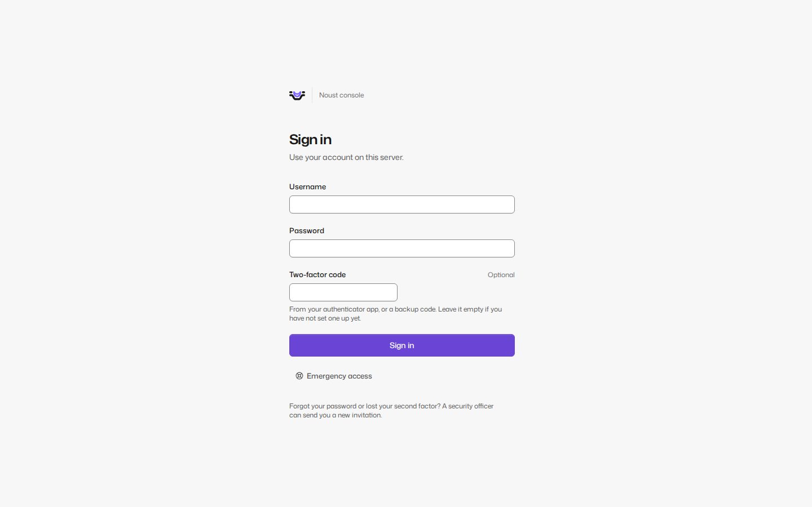

Sign in with your account: username, password and a code from your authenticator app, or a
passkey on its own. Browsers offer passkeys only on a certificate they trust, so over an SSH
tunnel or with a self-signed certificate the page says why the button is missing. The page does
not show the host name or the version before you sign in; `auth.login_label` sets a line that
tells your servers apart. After signing in, the console says when and from where you last signed
in and how many attempts failed since.

**A server with no accounts** signs in with the access token, as in 3.0, and then opens **Create
the first account**: an administrator, and (recommended) a security officer for another person.
Once an account exists, the access token is emergency access: it still signs in, and each use is
recorded. An invited person opens the invitation link, chooses a password and sets up a second
factor. Every account sets up a second factor, an authenticator app or a passkey, at its first
sign-in, before it can do anything else. When `auth.notice.text` is set, a notice of rights and
obligations is shown and must be accepted.

A session ends after 30 minutes without activity and 12 hours after sign-in (`auth.session.*`).
Five failed attempts lock the account for 15 minutes, and five from one address lock that
address; the page counts down.

## Layout

- **Sidebar**, in two groups: Overview, Applications, Databases, Domains and certificates,
  Backups; then Server, Cron, Activity. On a central, Fleet comes first. Settings is at the
  bottom. On a narrow screen it becomes a menu.
- **Top bar**: on a central, a server selector with three contexts: one server, **All servers**
  (the Fleet pages) and **This central** (the central's own settings). `/n/<server>/...` keeps
  the choice across a reload, the last server is remembered, and every page for one server shows
  its name above the title. Then the machine strip (host name, uptime, load, CPU, memory, disk,
  units running and failed), the command palette, the language switch, and the session menu
  (account, theme, keyboard shortcuts, sign out).
- The browser tab is titled `<page> - <hostname> - Noust`.

Every page follows one of the templates in [DESIGN.md](DESIGN.md): a list, a detail page with
tabs, settings with a side navigation, the dashboard, a wizard, a file editor, or the sign-in
column. Colour means state and nothing else: green running, amber in progress, red failed, grey
stopped, and violet for what you can interact with; chart series have a palette of their own.
Every state also has a shape and a text label. When a system tool fails, its own output is shown
verbatim in a monospace block, with the suggested fix above it.

## Pages

### Overview

How this server is doing, what needs you and what happened lately. Six key figures:
applications running and failed, deploys today, certificates due, backups in the last 24 hours,
disk, and pending system updates. Below them, what needs attention (worst first, each with the
way to fix it) beside recent activity as a timeline, then the machine's charts and quick actions.
When the charts' history is not being recorded, it says why and what to run. A server with
nothing deployed shows first steps instead. On a hub, the home page is the fleet summary.

### Charts

The charts drawn from the [metrics history](MONITOR.md#metrics-history) (the Overview's machine
charts, an application's Metrics tab and a database's Overview and Metrics tabs) behave the same
way everywhere.

- **A group of charts** shares one crosshair: pointing at one marks the same moment on the others,
  but only the chart under the pointer says the moment and its readings, and the rest keep the
  newest values in their row. A click no longer freezes anything: until 3.2 it froze that chart and,
  through the group, every other one until the next click. The keyboard still steps through the
  readings, and Escape hides the card.
- **Expanded**, a chart has the range selector and the zoom. Dragging across it selects a stretch
  of time, drawn as a translucent tint with solid edges so the readings under it stay visible, and
  zooms into it: the stretch is read again at a finer step.
- **Investigate this stretch** is a button of the expanded chart. It acts on the stretch on screen
  (the one you zoomed to, or the whole window) and opens a panel, "What happened in this stretch",
  with what Noust knows about it in one place, up to 31 days:
  - **Busiest processes**: the five processes with the most CPU and the five with the most memory
    in each minute, with the service, application or container each belongs to, the account, and
    (with `secrets.reveal`) its command line. A row selects that minute and lists its processes below; when the stretch is long,
    only its busiest minutes are listed, and the panel says so. This is what answers "why this
    peak". The monitor takes these samples once a minute while it runs, so there are none from
    before it started: the panel says "No process samples before ..." with the time they begin.
  - **Events**, oldest first, filtered by source, level and service: the system journal from
    warnings up, the audit log (commands, console and central actions, sign-ins, with who), what
    the monitor saw (processes over a threshold, units that failed or recovered, server boots),
    and the deployments and jobs that ran.
  - **Deployments and jobs**, each opening its page.

  On an application's Metrics tab the stretch is narrowed to that application: its journal (every
  priority), the audit events that name it, its deployments and jobs, and its processes. On a
  database's charts and the Overview it covers the whole server. A source you may not read is
  named with the permission it needs, never left out silently: the journal needs `secrets.reveal`,
  the audit log `audit.read`. A source that failed shows the system's own words. On a central,
  each server answers for what it saw. The same data is `GET /api/timeline`, see [api.md](api.md).

### Fleet

A [central's](CENTRAL.md) own pages, hidden on a plain server. Tabs: **Summary** (the fleet's
key figures and what needs attention on every server, worst first), **Servers** (reachability,
version, load, memory, disk, labels), **Applications**, **Certificates**, **Backups**,
**Updates** and **Activity**, each row with its server and a link to its page there. A server
that did not answer, is too old for a view, or refused you is one row with its state and its
own words; the rest of the page is unaffected.

**Bulk actions** (renew certificates, back up, verify backups, update or restart applications,
update Noust, apply system updates) are chosen from a list of servers or by label, show their
plan first (which servers, in which batches, what is skipped and why), and run as a fleet job
with each server's outcome and a button to retry the servers that failed. **Add a server**
starts the same flow as **Settings > Servers**.

On a fleet job's page, **Details** on a server's row opens what happened there:

- **A failure first**, with the server's own words verbatim and the suggested fix above them.
- **Its state**, how long it really took (or has been running), its batch, and what the job
  returned in words: for a system update, how many packages and which, whether a reboot is due
  (nothing is rebooted) and which services still run old libraries; for Noust's update, the version
  it went from and to; for a certificate renewal, each certificate renewed and its new expiry. A
  server older than 3.2 does not say which certificates, so nothing is guessed.
- **The job's log on that server**, in the log viewer (search, copy, download, follow the end):
  live while it runs, over the job WebSocket the central relays through the tunnel, and whole once
  it ended. A server that ran several jobs for the action has one tab per job.
- **Each application**, only for the actions that work per application (update, restart, back up,
  verify backups), with its domain, its result and a link to its deployment or its backup.
- **Open on the server**, a link to that job in the server's own Activity.

An operating system update that upgrades the `noust` package restarts the node's console in the
middle. The plan says so beforehand ("Also updates Noust: its console restarts, and the job waits for it"; Noust is installed last), and the
central waits for the node to come back and reads the result instead of counting a failure: the
node's console follows a job that runs in a transient systemd unit again after it restarts (see
[Live updates](#live-updates)), so the job ends as the unit did.

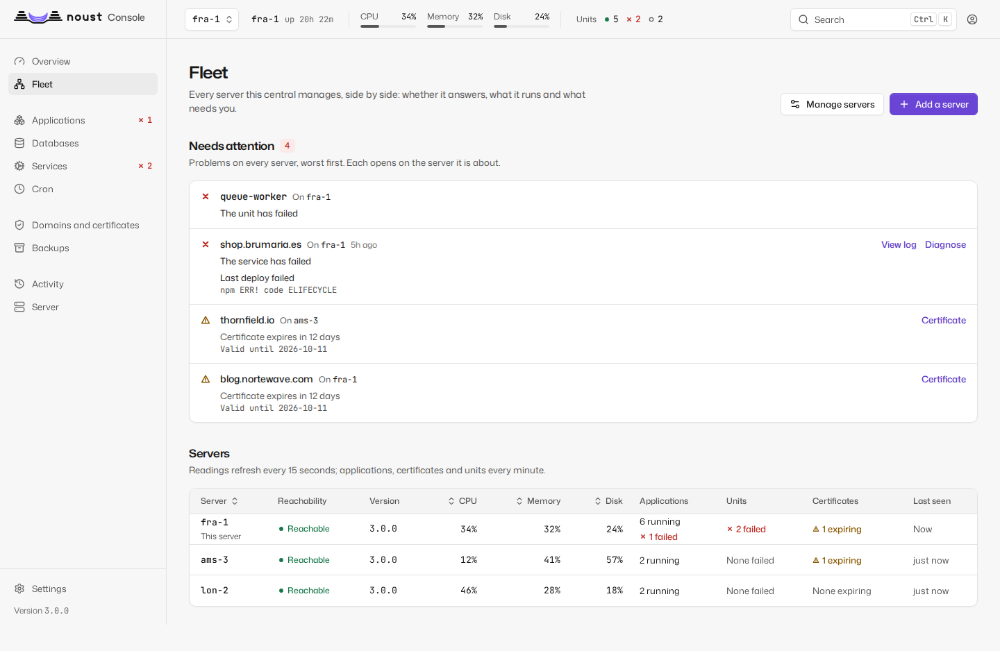

The server selector switches every other page to one server, and every action taken there
(including a destructive one, still behind "Confirm it's you") reaches that server's own API
through the central's tunnel. What the server's ceiling for the central does not allow is
greyed out with the reason. A hub (`central.role = hub`) deploys nothing of its own; switched to
a server, Applications (and every other page) is that server's own:

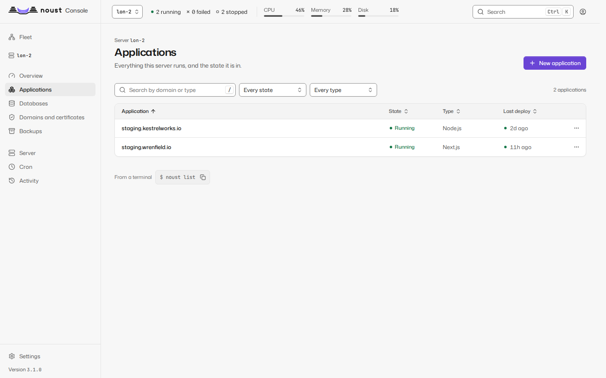

### Applications

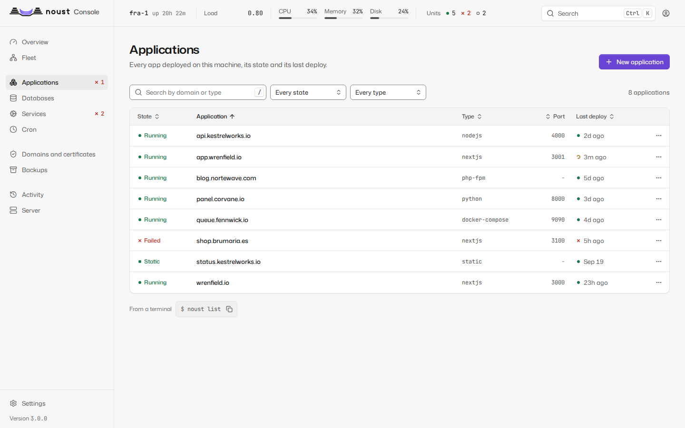

Every application with its state, type, port, last deploy, CPU and memory, filterable by
state and type. On a phone, rows become cards with their actions always visible.

**New application** (`/apps/new`) walks through **Server** (on a fleet only: which server
deploys it, so any server can be reached from one place), **Source** (a Git URL, a GitHub
repository, a directory on the server, a recipe or an export, and a branch), **Address**,
**Configuration**, **Variables**, **Database** (optional: one created and linked before the first
build, its connection string in the app's environment) and **Deploy**. The server inspects the repository before anything is created: the
detected type (editable), install, build and start commands, port, and the variables declared in
`.env.example` as a form, with secrets flagged. It checks the domain's DNS, then deploys and
streams the build log until the application answers. Switched to a server of the fleet, the
wizard deploys there.

The Source step also offers **A running stack**, for a Docker Compose stack that already runs on
this server and that Noust did not deploy (one started by its own `deploy.sh`, say). You give the
domain it serves and the directory it runs from, and under **More options** its compose file, the
site file that serves the domain, the repository updates fetch from and the branch. **Preview**
reads the project from the running containers' labels, finds the site, and shows the output of
`docker compose up --dry-run` verbatim: it must say nothing would be recreated. **Adopt** then
registers the stack without cloning, cleaning, rebuilding or restarting anything, and installs its
service without starting it. If the rehearsal lists changes, the adoption is refused with
Compose's own output, unless you tick **Adopt anyway, recreating what Compose lists** after reading
it. Adopting needs sudo mode. See [compose.md](compose.md#adopting-a-running-stack).

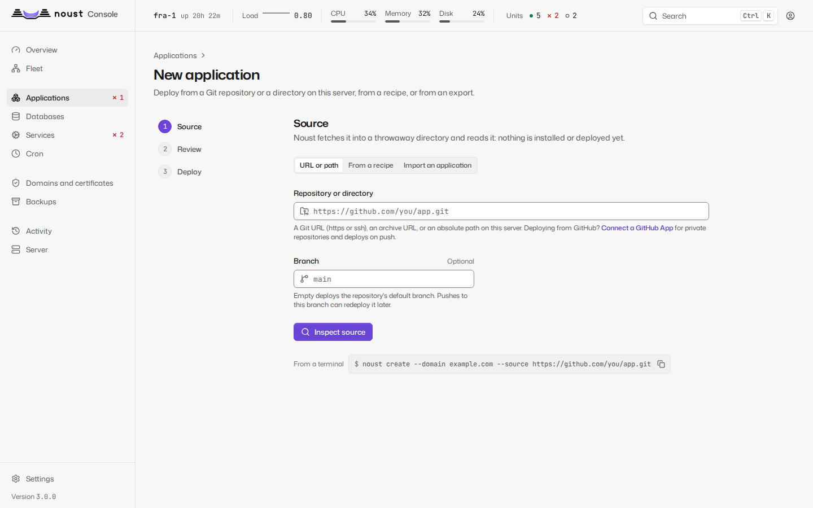

### One application

The header shows the domain, state, type, port and a link to the live site. A banner between the
header and the tabs appears while a job runs on it, when its last deploy failed or when it is
down, with a link to **Diagnose**. Tabs:

| Tab | What it has |
|---|---|
| Overview | Last deploy, uptime, certificate, domains, webhook, runtime facts, and resource use against its limits |
| Deployments | Deployment history; for an application with instant rollback, its releases with their status, and **Roll back to this** or **Activate** on each one on disk |
| Logs | The unit's journal, live |
| Metrics | CPU and memory (requests and errors for a static site) over an hour, a day, a week or a month, against its limits, with deploys marked; or why there is nothing to show |
| Environment | The `.env`, redacted; revealing and editing need sudo mode. Changes are staged and reviewed before saving; a restart applies them |
| Database | The databases it uses, creating and linking one, and its connection string |
| Domains | Primary, aliases and redirects, with a DNS check per name; add a name as an alias or a redirect (Docker Compose stacks that publish a port and monorepos included; see [domains.md](domains.md)) |
| Settings | One page per subsection, below |

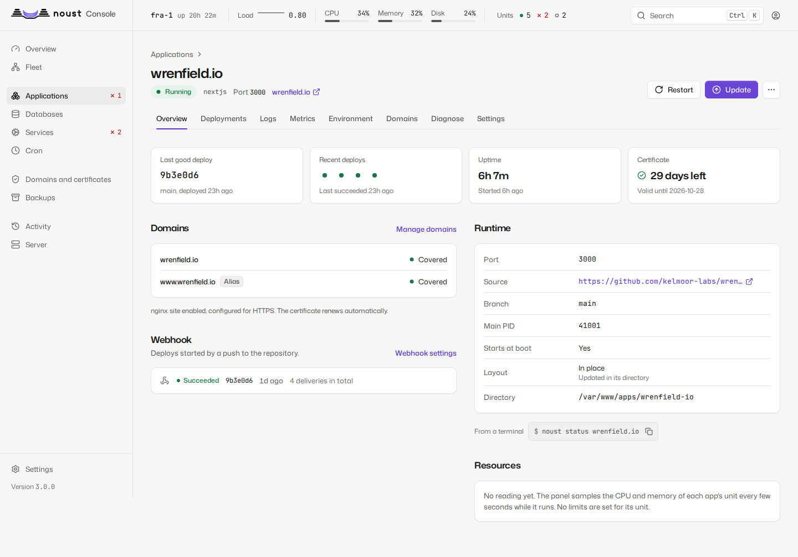

Each deployment has its own page: commit, trigger, duration, a phase timeline, the build log
(live while it runs, with "Show the whole log" when it was truncated), and on failure a link
to Diagnose plus Roll back and Redeploy.

A deployment that ran [deploy hooks](releases.md#hooks-and-schema-aware-rollback) lists them
under **Deploy hooks**, in the order they ran, before the new version served and after it did.
Each shows how it ended (succeeded, exited with a code, ran out of time, did not run), how long it
took, the service it ran in on a Compose stack, and the end of its output verbatim; Prisma's
automatic migration is listed the same way. The section also says whether the deploy changed the
database schema, and the list of deployments marks such a deploy with a **Database changed**
badge. When a hook that runs after serving failed, the page says **Deployed with warnings**: the
new version serves, nothing was undone, and the hook's output is shown (the `deploy_hook_failed`
notification says the same).

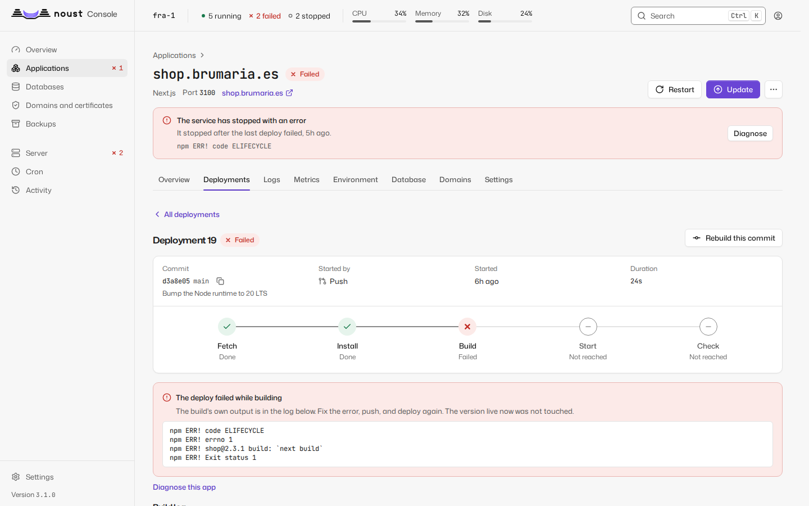

With instant rollback, rolling back switches `current` and restarts behind the health gate in
seconds, and is not a job. On an application in a single folder (in place), rolling back
restores a backup and runs as a job. See [releases.md](releases.md).

**Going back past a change to the database.** Noust puts code back, never a database. When later
deployments changed the schema, every way back asks first: rolling back to a deployment,
activating a release, the Roll back dialog's backups, and restoring a backup's files. Before you
press the button, the deployment's dialog says which deployments changed the schema after it. If
you go ahead, **Going back passes a change to the database** lists those deployments with the
migrations each one ran, names the backup taken before the first of them and the
`noust backup restore` command that puts the database back (for a Compose stack,
`--databases-only`), and **Go back anyway** repeats the request confirmed. A failed health gate
still puts back what served before, whatever the attempt changed. See
[releases.md](releases.md#hooks-and-schema-aware-rollback).

**Settings** has a side navigation, a URL per subsection, and a save bar ("N unsaved changes ·
Discard · Save"):

| Subsection | What it has |
|---|---|
| General | Type, port, source, the branch it deploys from (pin or unpin it), the tags it deploys (**Follow tags...**: a pattern such as `v*`; see [compose.md](compose.md#deploying-by-tag)), commands, how deploys work, the service and the account it runs as (**Give it its own account...**: its service, files and `.env` move to an account of its own and the app restarts once; if it does not answer afterwards everything is put back exactly as it was). On a Compose stack that publishes no port but still has one recorded, **A worker reported as down** offers **Record it as a worker...**, which clears the port and judges the stack by its containers |
| Deploys | **Instant rollback**: what it gives you, what changes on disk, the migration plan and a rehearsal, then the migration; releases kept; the health check; **Zero-downtime deploys** (blue/green; on a Docker Compose stack, the relay, which says what to change first when the stack or its site cannot use it); and on a Compose stack, **Copy of the databases before an update** |
| Deploy on push | The webhook as a guided setup: the public URL (`noust web expose-hooks`), the secret, the values to enter at the forge, the branch that deploys, and the last deliveries, ignored ones included. An app that follows tags says so here: releases and tags that match deploy, pushes to a branch do not, and a delivery for an older or unmatched tag is listed as ignored |
| Deploy hooks | The commands each deploy runs before the new version serves and after it does, where they come from (**From the repository**: the `noust.yaml` of the running code; or **From the operator**, which replaces it whole), each with its service, directory, time limit and whether it changes the schema. The operator's hooks are written here as YAML in the shape of a `noust.yaml`; saving asks for sudo mode and may wait for a second person's approval. An invalid `noust.yaml` is shown with the reason, and the next deploy fails with it until it is fixed or replaced by the operator's hooks. A static site has no hooks |
| Builds | Whether it builds in the sandbox or as root and why; **Test a sandboxed build**, then turn it on (the trial Noust runs by itself before the next update of an app that still builds as root is recorded here like one you ran, passed or failed); the network profile; building as root with a reason |
| Resources | Memory (MB, at least 64), CPU (percent of one core) and tasks (at least 16), optionally restarting so they apply now |
| Previews | Pull request previews and their settings |
| Export | The application as a file to import elsewhere |
| Delete | Delete the application; removing its files and its certificate are separate choices, both off until you tick them, and you type its domain to confirm |

### Diagnose

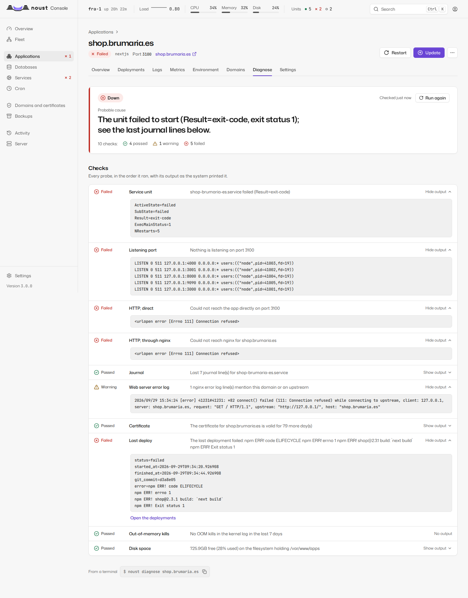

Reached from the application's banner, or `/apps/<domain>/diagnose`. Correlates the unit's
state, the port it listens on, an HTTP probe straight to the application and one through nginx,
the last journal lines, nginx's error log for the domain, the certificate, the last deployment,
OOM kills in the last seven days and disk space. The most likely cause comes first, with each
check's evidence verbatim. Every probe only reads. The same report is `noust diagnose DOMAIN`.
A Docker Compose stack that publishes no port (a worker) has no port or site to probe: it is
judged by its containers, and the evidence is their state and the last lines of `docker compose
logs`; when a port is still recorded for it, the report says so and names `noust app headless`.

### Databases

Two tabs: **Databases**, every database on every running engine with its size, application and
backups, and the ones created outside Noust to track; and **Engines**, each engine with its state,
version and end of life (install, start, stop, restart, uninstall). Database ports open beyond
the machine are flagged here.

One database's page has tabs: **Overview** (size, owner, application, backups, health),
**Data** (tables and rows, read-only, paged and filtered, with the columns' types; Redis keys;
editing one row needs sudo mode), **Query** (the SQL console: read-only by default, enforced
by the database server; history, saved statements, export, `EXPLAIN`; write mode needs sudo
mode), **Backups** (its policy with schedule, retention and destinations; restore as a new
database or over this one after a safety copy), **Users** (with owner, read-write and read-only
profiles, and password rotation), **Connect** (an SSH tunnel from your computer, never an open
port) and **Metrics**.

### Cron

Scheduled commands as systemd timers: create or edit with a preview of the next runs, run
now, enable, disable, and each job's recent runs with their output and exit status.

### Domains and certificates

Two tabs. **Certificates**: every certificate with its names, issuer and expiry; issue one
(method: automatic, nginx, Apache, webroot or standalone; extra names; `www`), renew those
due, renew one now, revoke, delete. **Sites**: every nginx or Apache site; create, enable,
disable, delete, and edit a site's configuration in a full-height editor with "Test" and "Test
and save": the web server tests it before it is installed.

The list shows every site file the web server has, the ones Noust wrote and the ones you wrote:
**Written by** says "Noust" or "By hand", and **Application** names the application whose site it
is, or says it is not an application's. A site written by hand is never rewritten by a deploy
(see [domains.md](domains.md#operator-sites)).

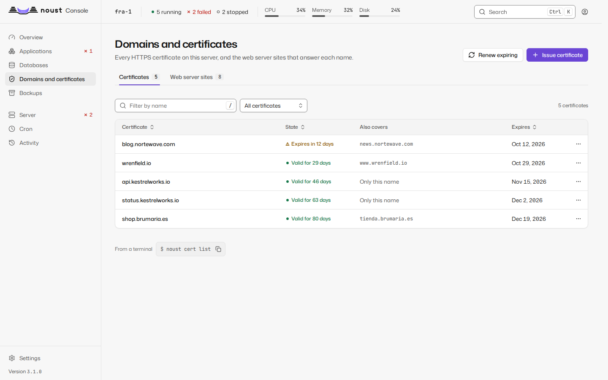

#### A site as text, structure and diagram

A site's page (`/domains/sites/<site>`) shows its configuration in three views, chosen with the
**View** control and kept in the URL (`?view=structure`, `?view=diagram`; the Text view has none).
Only nginx and Apache sites have all three. The views share **one draft**, the text: what you
change in one appears in the others, the bar at the foot (changed lines, **Discard**, **Test**,
**Test and save**) is the same, and leaving the page with changes asks first. There is **one way
to save**: the same `PUT /api/sites/{domain}/config` whichever view made the change, which needs
sudo mode, may need a second person's approval, and tests the whole text with the web server before
it writes anything. A site whose text cannot be read (a draft with a syntax error) shows the
analyzer's own message with its line and column and a **Go to text** button, never half a
structure.

- **Text** is the editor, as before.
- **Structure** shows the site as what it is:
  - a card per `server`: where it listens as chips (`443 · TLS · HTTP/2`, with `default_server` where it is one), its names, its
    certificate with the days left, its maximum body size, and a note when it answers every
    request itself with a `return`;
  - the **locations in the order the web server tries them**, not the order of the file (exact
    matches first, then the longest prefix, regular expressions in file order unless a `^~` prefix
    stops them). Each has its kind of match, its path, and where it goes: an upstream (a chip that
    scrolls to that upstream's card), a proxied address, the files of a directory, a redirect,
    FastCGI. The settings used most are fields in the row (read timeout, maximum body size, rate
    limit, WebSocket, buffering), and **More directives** opens every other directive of the
    location as written, editable;
  - **Upstreams** with their servers, how many locations use each, and "Defined in ..., read only
    here" for one an included file declares; **Other directives** (maps, zones, anything the
    structure does not model) and **Included files**, as written: nothing is hidden;
  - the comments of the file as notes next to the element they belong to;
  - **Add location** (**Proxy**, **Static files** or **Redirect**), and from each location's menu
    **Duplicate**, **Move up in the file**, **Move down in the file** and **Remove**. Moving is only
    ever what you ask for: the structure never reorders the file to tidy it.

  A text field applies when you press Enter or leave it, not on every key, and Escape puts back
  what the file says. Each change is an operation sent to the backend
  (`POST /api/sites/{domain}/config/edit`), which changes only the bytes of the element concerned
  and keeps its indentation; the rest of the file stays identical, comments and blank lines
  included. The answer is the new draft, and the changed elements are marked **Changed**. Nothing
  is written to disk until **Test and save**.
- **Diagram** is read only. It draws how a request travels, in columns: **Ports**, **Names**,
  **Locations**, **Destinations** and **Backends**. Every element has a shape and a text label;
  colour only says whether a backend answers (responds, not responding, unknown), always with its
  glyph and word, and a backend says who holds its port: a Noust application, a service of a
  Compose project, a container, a systemd unit or another process. Dashes move along each
  connection in the direction of the traffic, faster where the connection is encrypted, and a
  WebSocket is drawn as a double line; with `prefers-reduced-motion` they stand still. Pointing at
  or focusing an element lights its whole path, and pressing it keeps it lit. Under the drawing
  are a written summary (how many connections, which elements do not respond) and the same
  connections as a table behind **Show the connections as a table**. On a phone each column is a
  list. Whether a backend answers is the result of a one-second connection to its loopback port,
  cached for ten seconds; a draft is drawn from the unsaved text but its backends' state comes from
  the saved file.
- **Try a URL**, above the diagram, takes a full address or a path
  (`https://shop.example.com/api/`) and asks the backend which server and location answer it
  (`POST /api/sites/{domain}/route`); nothing is requested, the web server's rules are replayed over
  the file (or the unsaved draft). Only that path is lit and animated, a sentence says which
  location of which server answers the URL (or that the server answers it itself because no
  location matches, or that no server takes it), and a numbered explanation gives each step of the
  web server's choice: which server by port and name, which location by exact match, longest
  prefix or regular expression, and what that location does. It is the way to see why
  `/api/v1/auth/login` reaches the location it reaches and not the one you expected.

A server whose Noust is older than 3.2 (a 3.1 node reached through a 3.2 central) has no such
views: the page says "This server runs an older Noust" and **Edit as text** goes back to the
editor, which works as before.

### Backups

Three tabs: **Backups** (storage used per application, every backup: verify, restore, delete;
"New backup" with the same options as `noust backup create`), **Schedules** and
**Destinations** (remote places, their test and their key). The backup an update of a Docker
Compose stack takes first holds a dump of each database the stack runs, unless the application
turned that off under Settings > Deploys; putting the databases back is `noust backup restore
BACKUP_ID --databases-only` from a terminal. Restoring only the files past a deployment that
changed the database schema asks first, as going back does (see
[above](#one-application)).

### Activity

Every job and every audited action on this server in one timeline, newest first, filterable
by kind, result and actor. A job opens its log.

### Server

Seven tabs, each with its URL:

| Tab | What it has |
|---|---|
| Overview | What needs attention, then the machine at a glance; fits one screen |
| Updates | Pending updates, security first; apply all or only security; refresh; "a reboot is due" and why; services on replaced libraries; automatic updates; the history of runs |
| Security | Hardening checks with their fix or exact steps, accepted risks; SSH (effective settings, keys, safe fixes that revert unless confirmed); the firewall against the ports that really answer; fail2ban |
| Storage | Real filesystems, what takes their space, clean-ups, swap |
| Services | Every systemd unit Noust manages ("Show all units" lists the rest, read-only); a service's page has its live journal, controls and a unit editor checked with `systemd-analyze verify` |
| Logs | The journal of any unit, with filters |
| System | Time and synchronisation, host name, the operating system and its end of life, processes, network, reboot and shut down (now or scheduled), and the resource monitor |

`/services` redirects to Server > Services.

**Time zone.** On the System tab, **Change time zone** opens a dialog with a searchable list of the
zones the managed server itself knows (`GET /api/server/clock/timezones`; on a central, the
selected server computes them, not your browser). Type a name, a city, an abbreviation or an
offset (`madrid`, `cest`, `+2`, `utc+1`) and the list narrows; zones are grouped by region, each
option shows the name (`Europe/Madrid`), the city and its offset and abbreviation now
(`UTC+02:00 · CEST`), and the zone in use is marked **In use**. Under the list, the time the
server's clock will read with the zone you chose. Cron jobs and scheduled backups run at local
times, so their timers move with the zone, and the toast says how many moved. A server whose Noust
is older than 3.2 does not list its zones: the dialog says so and the name is typed, as before.

**Processes.** Click a column header (Process, PID, CPU, Memory) to sort; the order is applied by
the server, each column in its natural direction (CPU and Memory busiest first, PID and Process in order),
and the CPU and Memory headers sort the view grouped by service. The button under the table says how many there are ("Show the first 50 of 213") and keeps
the rows already listed while the longer list loads. The console never signals a process.

### Settings

A side navigation with a page per section. On a central, each section says whose it is: the
selected server's, or this central's.

| Section | Scope | What it has |
|---|---|---|
| General | Server | Applications directory, web server, certificate email, backups, the server's name, and the console address `--open` links use |
| Notifications | Server | Whether notifications are on, at the top (amber when they are on but no channel is set up; see [Features that are on or off](#features-that-are-on-or-off)); channels (webhook, Slack, Discord, Telegram, email) in drawers, with a test each; which events notify, among them **Deployed with warnings** (`deploy_hook_failed`), **Application not answering** (`app_unreachable`) and **Application answering again** (`app_recovered`), all on by default; private destinations allowed |
| Integrations | Server | The GitHub App |
| About | Server | Version and updates, installation, CLI equivalents, links |
| Servers | Central | Every server, its reachability, version, ceiling and labels; **Add a server** walks through `noust fleet authorize` and the join code; test and remove |
| Accounts | Central | Accounts, roles, invitations, separation-of-duties exceptions (with `accounts.read`) |
| Security | Central | Your password, second factor and passkeys; sessions; the sign-in policy and the notice |
| API tokens | Central | Your tokens: issue (shown once), narrow, list and revoke |
| Approvals | Central | Four-eyes requests: yours, and those waiting for you to decide |
| Audit log | Central | The audit trail, its verification, destinations and reviews (with `audit.read`) |
| Compliance | Central | `noust ens check` and the evidence report |
| Central | Central | The role, the certificate and the seal |

On a server without a fleet, every section is the server's own. What a server's own accounts,
tokens and second factor are cannot be changed from a central; the page says how to manage them
on the server.

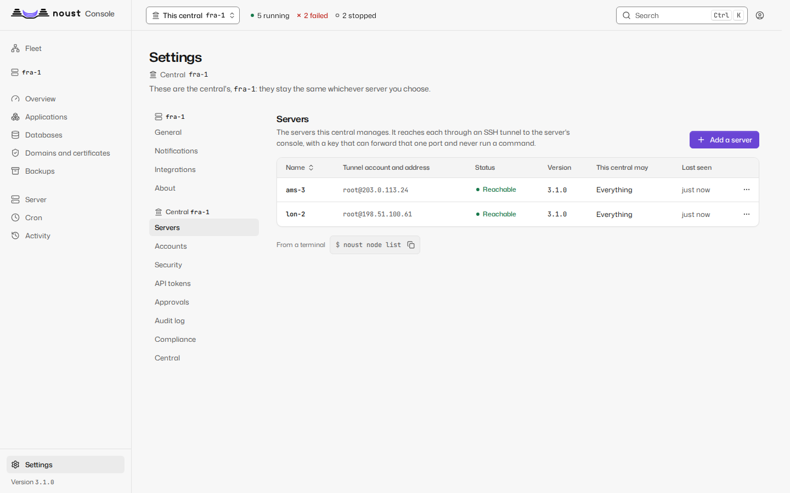

Writing any setting needs sudo mode.

## Features that are on or off

A page that configures a feature opens with its state in one block, at the top, where earlier
versions had a neutral message in which only a word changed. The state is a colour, a glyph and a
word at once, so it reads without reading the sentence under it:

| State | Shown as | Beside the title |
|---|---|---|
| On | The running green, a switch drawn on, "Enabled" in strong type | What it does for you |
| Off | Grey, a switch drawn off, "Disabled" | What being off means for you, and the action that turns it on |
| On with a problem | Amber and a warning triangle, never green: it is on but cannot do what it says | The problem by name ("Enabled, but no channel"), and the action that fixes it |

The block appears on Settings > Notifications, Settings > Approvals, the second factor in
Settings > Security, scheduled backups on the Backups page, automatic updates on Server > Updates,
and in an application's settings for instant rollback, zero-downtime deploys, builds in the
sandbox and pull request previews. A change of state pulses once; with `prefers-reduced-motion`
it does not. The block is the design system's `FeatureState`, see [DESIGN.md](DESIGN.md).

## Keyboard

| Keys | Does |
|---|---|
| `Ctrl K` / `Cmd K` | Open the command palette, from anywhere |
| `g` `o` | Go to Overview |
| `g` `a` | Go to Applications |
| `g` `b` | Go to Databases |
| `g` `f` | Go to the Fleet (a central) |
| `g` `s` | Go to Settings |
| `g` `d` | Go to the application's Deployments tab; outside an application, to Activity |
| `/` | Focus this page's search, or open the palette when it has none |
| `?` | Show the keyboard shortcuts |

Two-key sequences are typed one after the other within about a second. They do nothing while
you type in a field or while a dialog is open. Inside a log viewer, `Ctrl F` / `Cmd F`
focuses its search; `Enter` and `Shift Enter` step through matches.

The **command palette** searches pages (including each Settings section), applications with
their state, and actions: new application, change theme, keyboard shortcuts, sign out. Arrow
keys or `Ctrl N` / `Ctrl P` move, `Enter` runs, `Esc` closes.

## Sudo mode

Destructive and credential-changing actions (deleting anything, restoring a backup, revealing
or editing an `.env`, moving to instant rollback, changing limits, editing a unit or a site,
writing an application's deploy hooks, adopting a Compose stack, SQL in write mode, server
changes, managing accounts, changing settings, issuing a token) ask
you to confirm it is you: a dialog titled "Confirm it's you" asks for your passkey, or a code from
your authenticator app or one of your backup codes (for the access token, its code, or the token
itself when it has none). You already gave your password and a code when you signed in, so one
factor is enough, unless the server asks for the password again (`auth.sudo.require_password`,
always under the ENS profile), in which case the dialog also shows the password field. The
confirmation stays open while you keep working: every destructive action extends it, for up to 2
hours from when you confirmed (15 minutes without one, 2 hours at most, under `auth.sudo.*`; 10 and
30 under the ENS profile), and the dialog says so with the server's numbers. The action you were
taking is retried once confirmed. Flows that already know they need it, such as deleting an
application, ask before their own confirmation dialog, so only one is ever on screen.

When approvals are on, an action that needs a second person becomes a request instead of
running: the console says so, it appears under Settings > Approvals for whoever may decide it,
and once approved you run it again from the same place, once.

## Live updates

The console holds one Server-Sent Events stream for the machine strip, charts, application
states, job progress and notifications, and opens a WebSocket for a log or a running job
while you look at it. If the connection drops it reconnects with backoff and refreshes
everything it shows. Log viewers render ANSI colours, search, follow the newest line (pausing
when you scroll up, with a "Jump to latest" button), wrap, copy and download.

A job runs on a thread of the console, so a console that restarts ends the jobs it was running:
they are marked "Interrupted by a panel restart". The exception is work that runs in a transient
systemd unit of its own (applying operating system updates, and Noust updating itself), which
keeps going when the console restarts, and a `noust` package among the updates is precisely what
restarts it. The job records its unit, and the console that starts again follows it
instead of failing it: when the unit ended well the job completes with the unit's output appended
to its log, when it failed the job fails with systemd's result and the unit's own words, and when
it is still running the job stays running, its log grows as the unit writes, and it ends with the
unit, or gives up after a deadline and says how to follow it. A job with no unit recorded is still
marked interrupted.

## Themes

Light, dark, or the system's (the default), from the session menu or the command palette.
The choice is kept in the browser's local storage (`noust.theme`; a choice saved by WASM as
`wasm.theme` is carried over) and applies to every open tab.

## From the terminal

`--open` on `noust list`, `noust status`, `noust logs`, `noust db list`, `noust backup list` and
`noust monitor status` prints the matching console URL, and opens it when a display is
available. The address comes from `web.host` and `web.port` in the configuration (Settings >
General), which only affect these links: where the console listens is decided by the options
of `noust web start`.

## Accessibility

The console targets WCAG 2.2 level AA, and that is tested rather than declared:

- The end-to-end suite runs axe (WCAG 2.0, 2.1 and 2.2, levels A and AA) on every page, in
  both themes, and fails on any violation. It also fails on any Content Security Policy
  violation or console error.
- Colour contrast of the design tokens is checked by unit tests in both themes: 4.5:1 for
  text, 3:1 for interface elements.
- Everything works from the keyboard. Focus is always visible, a "Skip to content" link comes
  first, dialogs trap focus and return it, and after navigating focus moves to the new page's
  title.
- State is never colour alone: it always has a shape and a text label.
- Deploy transitions are announced politely and failures assertively through live regions.
  Log lines are never announced.
- Every chart has a text summary, works from the keyboard (arrow keys step through readings,
  announced in a live region), and its expanded view has a Data tab with the readings as a
  table.
- A site's diagram has a written summary under it and the same connections as a table; every
  element can be focused from the keyboard and has an accessible name that includes its state.
- With `prefers-reduced-motion`, transitions are instant and the moving dashes of the diagram
  stand still.

If something in the console is not usable with your assistive technology, please open an
issue on GitHub.
